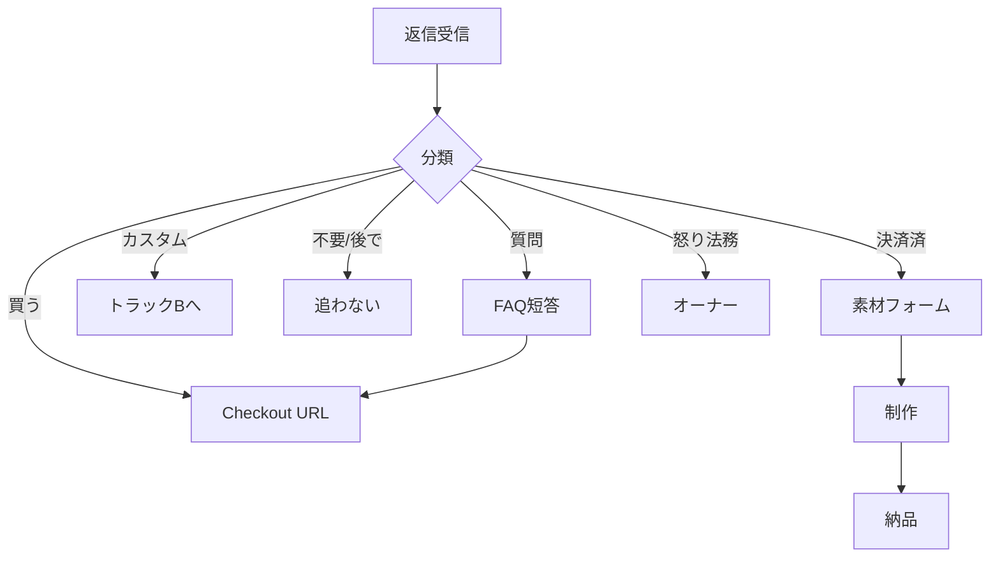

# デモ買い取り — 返信分類（Inbox相当）

> Step 6 成果物（2026-08-20）
> 方針: **返信を決済にする。会話で売らない。**
> 商品: [`demo_buyout_plan.md`](./demo_buyout_plan.md)
> メール: `templates/email_demo_buyout_*.txt`
> 素材: [`demo_buyout_intake_form.md`](./demo_buyout_intake_form.md)

## やる / やらない

### やる

- 返信を分類する（下表）
- **買う** → Checkout URL だけ返す
- **質問** → プラン範囲内で短く答える → 必要なら Checkout
- **カスタム** → トラックBへ（ヒアリング2〜3問）
- **不要** → 追わない。リストから外す
- **決済確認後** → 素材フォームURLを送る
- **納品後7日** → 小さなアップセル（任意・1通まで）

### やらない

- 通話・Zoom・「15分だけ」
- 値引き・分割・66,000円の範囲拡大
- 買い取り相手に長いヒアリング
- 決済前に差し替え制作を始める
- 怒り・法務以外をオーナーに丸投げ

---

## 分類一覧

| 分類 | キーワード例 | 返信テンプレ | 次のアクション |
|---|---|---|---|
| **A 買う** | 購入希望 / 買いたい / この内容で / 決済したい / いいね | `email_demo_buyout_2_checkout.txt` | Checkout URL |
| **B 質問** | 何が含まれる / 修正 / ドメイン / 納期 / 写真が無い | `email_demo_buyout_3_faq.txt` | 短答＋Checkout |
| **C カスタム** | デザイン変更 / ページ追加 / ゼロから / もっと作り込み | `email_demo_buyout_4_custom_handoff.txt` | トラックB |
| **C+ 混合** | 上記＋同一メールで質問 | 短答＋`4_custom_handoff` | カスタム優先・Checkoutなし |
| **D 不要** | 不要 / 見送り / 今は / 結構です / STOP | `email_demo_buyout_6_decline.txt` | 送信停止 |
| **E 後で** | また連絡 / 検討中 / 忙しい | 6_decline に近い短文 | 追わない |
| **F 決済済** | （Stripe通知 or 「支払いしました」） | `demo_buyout_intake_form.md` 文A | 素材フォーム |
| **G 素材提出** | フォーム回答通知 | `demo_buyout_intake_form.md` 文D | 制作開始 |
| **H 怒り・法務** | 迷惑 / 削除 / 権利 / 弁護士 | — | **オーナーへ** |

迷ったら **B 質問** として短く答え、売り込まない。  
ただし **「ページ追加／デザイン変更」＋質問** が同居したら → 下の **C+（混合）**（カスタム優先）。

---

## エージェント／オーナーの役割（2026-08-21確定）

| 局面 | 誰が返す | 内容 |
|---|---|---|
| A 買う | エージェント | Checkout URL（確認不要）※**旧価格コホート除く** |
| B 質問のみ | エージェント | FAQ短答＋必要ならCheckout ※**旧価格コホート除く** |
| C カスタム／**C+ 混合** | エージェント | カスタム誘導（＋質問への短答）。確認不要 |
| D/E 不要 | エージェント | 了承・追わない |
| F 決済済 | エージェント | 素材フォーム案内 |
| ヒアリング回答後の見積もり | **オーナー確認後** | 金額・範囲・納期の具体 |
| 値引き・分割・交渉 | **オーナー確認後** | |
| H 怒り・法務 | **オーナー** | |
| **旧価格コホート（55,000円）の A/B/決済** | **オーナーのみ** | 66,000円決済メール禁止 |

---

## 旧価格コホート（2026-08-22 オーナー指示）

初回メールを **55,000円（税込）** で送った3社。返信が来ても **66,000円の決済メールは送らない**。

| 社名 | email | quoted_price |
|---|---|---|
| 株式会社新見工務店 | niimi-230@outlook.jp | 55000 |
| 株式会社福澤工務店 | construction@k-fukuzawa.co.jp | 55000 |
| 株式会社日南工務店 | info@nichinankoumuten.jp | 55000 |

CSV列 `quoted_price=55000` で判定する。

### この3社から返信が来たとき

| 分類 | エージェント | 禁止 |
|---|---|---|
| **A 買う** | **オーナーへエスカレ**（「購入希望」等を通知） | `email_demo_buyout_2_checkout.txt`（66k）を送らない |
| **B 質問** | 初回メールどおり **55,000円・差し替え納品** の範囲で短答可。v1.1（66k・本番切替込み）の文言は使わない | 66k Checkout URL |
| **C / C+** | 通常どおりカスタム誘導 | 66k Checkout URL |
| **D / E** | 通常どおり | — |
| **フォロー** | `email_demo_buyout_5_followup.txt`（66k表記）は **送らない** | 66kで再案内 |

**決済URL（55,000円）はオーナーが送る。** エージェントは Stripe Link を貼らない。

---

## 分類フロー



---

## パターン別の返し方

### A — 買う

**条件:** デモ内容で進めたい意思がはっきりしている。

**返すもの:**
- Checkout URL のみ（`demo_buyout_lp_checkout.md` の Payment Link）
- 納期・素材フォームの一文

**返さないもの:**
- 長い説明
- カスタム価格表
- 打ち合わせの提案

テンプレ: `email_demo_buyout_2_checkout.txt`

---

### B — 質問

**条件:** 範囲・納期・ドメイン・写真なし等。

**答える範囲（`demo_buyout_plan.md` のみ）:**
- 含む / 含まない
- 66,000円（税込）固定（切替込み）
- 修正1回、納期5〜7営業日（切替込み）
- 初期公開は当社側URL

**答えない / 即カスタムへ:**
- 「デザインをこう変えて」→ C
- 「ページを10枚」→ C
- 「文章全部書いて」→ C
- 「安くして」→ 値引きしない。範囲を説明してCheckout

テンプレ: `email_demo_buyout_3_faq.txt`

---

### C — カスタム

**条件:** 買い取り66,000円の範囲外の要望。

**返すもの:**
- 買い取りではない旨（1文）
- ヒアリング2〜3問
- カスタム価格の目安（1ページ完結 15〜20万 / 集客型 40〜60万・SEO・GEO込み）

**返さないもの:**
- 66,000円で無理に飲み込む提案
- 買い取り用 Checkout URL

テンプレ: `email_demo_buyout_4_custom_handoff.txt`  
以降（ヒアリング回答後）はオーナー確認のうえ `email_step2_hearing.txt` → `email_step3_estimate.txt`

---

### C+ — 混合（カスタム希望＋質問が同一メール）

**条件の例:** 「ページを増やしたい」＋「納期は？」「写真無くても？」など。

**優先順位:** カスタム（C）を主にする。質問は無視せず短く添える。

**返す型（この順）:**
1. ページ追加／デザイン変更希望を承知（買い取りではなくカスタムで提案）
2. 質問への短答（事実のみ・1〜3行。通話提案しない）
3. ヒアリング3問＋価格目安（`email_demo_buyout_4_custom_handoff.txt` の本文）

**やらないこと:**
- 買い取り決済URLを送る
- 66,000円にページ追加を含める
- 質問対応だけでカスタム誘導を先送りする
- 見積もりの具体額をこの時点で書く（ヒアリング後＋オーナー確認）

エージェントがこの型で返信してよい（オーナー確認不要）。

---

### D / E — 不要・後で

**条件:** 明確な拒否、または「今は無理」。

**やること:**
- 短く了承
- **追わない**（フォロー3通目も送らない）
- リスト `status=paused`

テンプレ: `email_demo_buyout_6_decline.txt`

---

### F — 決済済

**トリガー:** Stripe `checkout.session.completed` または本人から「支払いしました」

**やること:**
1. 決済と注文IDを照合
2. 素材フォームURLを送る（`demo_buyout_intake_form.md` 文A）
3. **制作は素材受領まで開始しない**

本人が先に「支払いしました」と言った場合:
- Stripeで確認できてからフォーム送付
- 確認できない場合は「確認でき次第フォームをお送りします」と1通だけ

---

### G — 素材提出

**トリガー:** フォーム回答・必須項目充足

**やること:**
1. [`demo_buyout_intake_form.md`](./demo_buyout_intake_form.md) の社内チェック
2. 問題なければ制作開始メール（文D）
3. 納期 `{deadline_date}` を記載
4. 同時進行は **3件まで**（`demo_buyout_plan.md`）

不足がある場合:
- **1通だけ** 不足項目を返す。往復を増やさない。

---

### H — 怒り・法務

**条件:** 迷惑メール、権利侵害、削除要求、脅迫。

**やること:**
- 送信停止
- オーナーへエスカレーション
- こちらから追加営業しない

---

## 未返信フォロー（Sender相当）

| 通 | タイミング | 条件 | テンプレ |
|---|---|---|---|
| 1通目 | 初回 | — | `email_demo_buyout_1_initial.txt` |
| 2通目 | 4〜6日後 | 未返信のみ | `email_demo_buyout_5_followup.txt` |
| 3通目 | 送らない | — | 追わない |

2通目以降、**新しいデモは作らない**。同じデモURLを再掲。

---

## 納品後（任意・1通）

納品 **7日後**。小さな追加のみ。

| 提案 | 目安 |
|---|---|
| ページ1枚追加 | 11,000円 |
| フォーム強化 | 11,000円 |
| LINE問い合わせ | 33,000円〜 |
| 月次保守 | 5,500〜11,000円/月 |

大きなDX提案は、返信があった場合のみ。

---

## リスト管理（手動でよい）

正本: `sales/knowledge/demo_buyout_leads.csv`（Hunter列含む。収集ルールは `demo_buyout_hunter.md`）

想定列:

| 列 | 例 |
|---|---|
| company | 株式会社〇〇 |
| email | info@... |
| site_url | https://... |
| demo_url | https://... |
| status | `sent` / `replied` / `paid` / `intake` / `delivered` / `paused` |
| reply_class | A〜H |
| quoted_price | `55000`（旧価格コホート）/ `66000`（v1.1以降の新規） |
| notes | 課題メモ |

status の遷移:

```
sent → replied → paid → intake → ready → delivered
                ↘ paused（不要・怒り）
```

---

## チェックリスト（返信処理）

1. [ ] 分類した（A〜H）
2. [ ] 該当テンプレを使った（新規文を書きすぎていない）
3. [ ] **quoted_price=55000 なら 66k Checkout を送っていない**（`verify-inbox-reply.mjs` PASS）
4. [ ] 66,000円の範囲外を無理に引き受けていない
5. [ ] 決済確認前に制作を始めていない
6. [ ] 不要・怒りは追っていない
7. [ ] リスト status を更新した

---

## 完了条件（Step 6）

- [x] 分類表とフローがある
- [x] 各分類と既存テンプレが対応している
- [x] 決済→素材→制作のゲートが明確
- [ ] 実際の受信箱自動化（→ Step 8）
